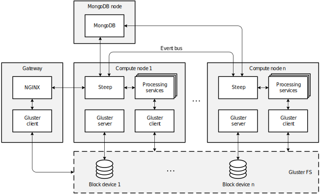

# Run the Montage workflow with Steep on AWS

This repository demonstrates how to run the
[Montage workflow](http://montage.ipac.caltech.edu/) with
[Steep](https://github.com/steep-wms/steep) on the
[AWS](https://aws.amazon.com/) cloud.

**IMPORTANT:** If you run the workflow on AWS, you may be charged for used
resources. While it will most likely only cost you a few dollars, we're not
responsible for any charges that may incur. **DO NOT FORGET TO [DESTROY THE
DEPLOYED INFRASTRUCTURE](#step-8-destroy-your-infrastructure) AFTER THE
EXPERIMENT!**

## Step 1: Prerequisites

You need to have the following tools installed:

* [AWS CLI](https://github.com/aws/aws-cli) to connect to Amazon Web Services
* [Terraform](https://www.terraform.io/) to create the infrastructure on AWS
* [Ansible](https://www.ansible.com/) to provision the created virtual machines

Make sure you have configured your AWS CLI with `aws configure` and that you
can successfully connect to your AWS account.

## Step 2: Initialization

Edit the file [terraform.tfvars](terraform.tfvars). You MUST set the variables
`aws_profile` and `keypair`. `aws_profile` is the local AWS profile that you
configured with AWS CLI and `keypair` is the name of the public and private key
pair you use to log in to AWS virtual machines. The other variables already
have default values. You may change them according to your needs.

After this, initialize the Terraform environment with the following command:

    terraform init

## Step 3: Deploy the infrastructure to AWS

Run the following command:

    terraform apply

This will create a network, block devices, and virtual machines in your
AWS account. The process takes a few minutes.

## Step 4: Deploy software

Terraform automatically creates an Ansible inventory in the `ansible` directory.
Run the following command:

    ansible-playbook -i ansible/hosts ansible/site.yml

This will provision the virtual machines with the required components
(including Steep). The process takes a few minutes.

The following figure shows an overview of the final infrastructure with the
deployed software:

## Step 5: Submit the workflow

Submit one of the parallel workflows from the
[steep-montage repository](https://github.com/steep-wms/steep-montage). For
example, use the following command to submit `montage_parallel_rgb.yaml`, which
calculates a 2.8 square degrees RGB mosaic of 2MASS images (J-, H-, and K-band)
centred on NGC 3372 ([Carina Nebula](https://en.wikipedia.org/wiki/Carina_Nebula)).

    export GATEWAY_IP=$(terraform output gateway_ip)
    curl -X POST http://$GATEWAY_IP/steep/workflows \
      --data-binary @../steep-montage/workflow/montage_parallel_rgb.yaml

(This command assumes that you have checked out the steep-montage repository
to `../steep-montage`.)

Open Steep's web interface and monitor the progress of the workflow. Wait
until it is completed.

    open http://$GATEWAY_IP/steep

## Step 6: Download results

After the workflow has finished, you can download the final mosaic from Gluster
FS through the gateway node:

    scp ubuntu@$GATEWAY_IP:/$(ssh ubuntu@$GATEWAY_IP "find /data/out/ -name '*.jpg'") .

It should look like the [image below](#final-result).

## Step 7: Destroy your infrastructure

**IMPORTANT:** Do not forget to destroy your infrastructure after the experiment:

    terraform destroy

## Final result

## License

The files in this repository are licensed under the
[Apache License, Version 2.0](http://www.apache.org/licenses/LICENSE-2.0).

Unless required by applicable law or agreed to in writing, software
distributed under the License is distributed on an "AS IS" BASIS,
WITHOUT WARRANTIES OR CONDITIONS OF ANY KIND, either express or implied.
See the License for the specific language governing permissions and
limitations under the License.

## Montage License

The workflow uses the [Montage toolkit](https://github.com/Caltech-IPAC/Montage)
released under a [BSD 3-clause license](https://github.com/Caltech-IPAC/Montage/blob/master/LICENSE).

Copyright (c) 2014 California Institute of Technology, Pasadena, California.

THIS SOFTWARE IS PROVIDED BY THE COPYRIGHT HOLDERS AND CONTRIBUTORS "AS IS" AND
ANY EXPRESS OR IMPLIED WARRANTIES, INCLUDING, BUT NOT LIMITED TO, THE IMPLIED
WARRANTIES OF MERCHANTABILITY AND FITNESS FOR A PARTICULAR PURPOSE ARE
DISCLAIMED. IN NO EVENT SHALL THE COPYRIGHT HOLDER OR CONTRIBUTORS BE LIABLE
FOR ANY DIRECT, INDIRECT, INCIDENTAL, SPECIAL, EXEMPLARY, OR CONSEQUENTIAL
DAMAGES (INCLUDING, BUT NOT LIMITED TO, PROCUREMENT OF SUBSTITUTE GOODS OR
SERVICES; LOSS OF USE, DATA, OR PROFITS; OR BUSINESS INTERRUPTION) HOWEVER
CAUSED AND ON ANY THEORY OF LIABILITY, WHETHER IN CONTRACT, STRICT LIABILITY,
OR TORT (INCLUDING NEGLIGENCE OR OTHERWISE) ARISING IN ANY WAY OUT OF THE USE
OF THIS SOFTWARE, EVEN IF ADVISED OF THE POSSIBILITY OF SUCH DAMAGE.
